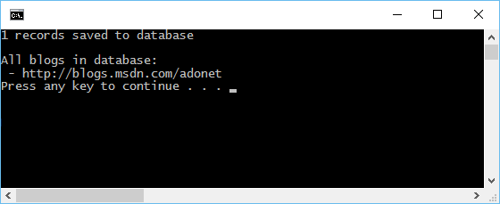

# .NET Framework 下的 EF Core 新数据库入门指南

在这个演练中，你将使用 Entity Framework 构建一个针对 Microsoft SQL Server 数据库执行基础数据问的控制台应用程序。你将使用迁移来从模型创建数据库。

> 提示
>
> 你可以[在 GitHub 上查阅当前文章的涉及的代码样例](https://github.com/aspnet/EntityFramework.Docs/tree/master/samples/core/GetStarted/FullNet/ConsoleApp.NewDb)。

## 先决条件

以下是完成当前演练所需的先决条件：

* [Visual Studio 2017](https://www.visualstudio.com/downloads/)
* [最新版本的 NuGet 程序包管理器](https://dist.nuget.org/index.html)
* [最新版本的 Windows PowerShell](https://www.microsoft.com/en-us/download/details.aspx?id=40855)

## 创建新项目

* 启动 Visual Studio
* 文件 > 新建 > 项目...
* 从左侧菜单开始选择 模板 > Visual C# > Windows 经典桌面
* 选择 **控制台应用（.NET Framework）** 项目模板
* 确保目标框架为 .NET Framework 4.5.1 或更新的版本
* 设置项目名称并点击 **确定**

## 安装 Entity Framework

要使用 EF Core 的话，就要根据你的目标数据库提供程序安装相应的程序包。当前演练使用的是 SQL Server。查看 [数据库提供程序](../../7、数据库提供程序/A、数据库提供程序.md) 可获得可用提供程序的列表。

* 工具 > NuGet 包管理器 > 程序包管理控制台
* 运行 `Install-Package Microsoft.EntityFrameworkCore.SqlServer`

迟一点我们还将使用一些 Entity Framework 工具来维护数据库。所以我们还要安装工具包：

* 运行 `Install-Package Microsoft.EntityFrameworkCore.Tools`

## 创建模型

现在，是时候定义构成你的模型的上下文和实体类型了。

* 项目 > 添加类...
* 输入名称 _Model.cs_ 然后点击 **确定**
* 使用以下代码替换类文件中的内容：

```C#
using Microsoft.EntityFrameworkCore;
using System.Collections.Generic;

namespace EFGetStarted.ConsoleApp
{
    public class BloggingContext : DbContext
    {
        public DbSet<Blog> Blogs { get; set; }
        public DbSet<Post> Posts { get; set; }

        protected override void OnConfiguring(DbContextOptionsBuilder optionsBuilder)
        {
            optionsBuilder.UseSqlServer(@"Server=(localdb)\mssqllocaldb;Database=EFGetStarted.ConsoleApp.NewDb;Trusted_Connection=True;");
        }
    }

    public class Blog
    {
        public int BlogId { get; set; }
        public string Url { get; set; }

        public List<Post> Posts { get; set; }
    }

    public class Post
    {
        public int PostId { get; set; }
        public string Title { get; set; }
        public string Content { get; set; }

        public int BlogId { get; set; }
        public Blog Blog { get; set; }
    }
}
```

> 提示
>
> 在真是的应用程序里面你会将每个类型放到独立的文件中，并且将链接字符串放到 `App.config` 文件中，然后使用 `ConfigurationManager` 来读取它。为了简单起见，我们将当前课程中的所有代码都放到单一的文件中。

## 创建数据库

你已经有一个模型了，你可以使用迁移来创建数据库。

* 工具 > NuGet 包管理器 > 程序包管理控制台
* 运行 `Add-Migrations MyFirstMigration` 以搭建一个迁移基架来为你的模型创建初始的表集合。
* 运行 `Update-Database` 以将新的迁移引用到数据库。由于你的数据库还不存在，所以这里将在应用迁移之前为你创建数据库

> 提示
>
> 如果你对你的模型做了进一步更改，可以使用 `Add-Migration` 命令搭建新的基架来确保相应的模式能变更到数据库。一旦你签出了基架代码（并根据需要做了任何变更），可以使用 `Update-Database` 命令将变更应用到数据库。
>
> EF 在数据库使用 `__EfMigrationHistory` 表来记录哪些迁移已经被应用到数据库。

## 使用模型

现在，你可以使用模型进行数据访问了

* 打开 _Program.cs_
* 使用以下代码替换类文件中的内容：

```C#
using System;

namespace EFGetStarted.ConsoleApp
{
    class Program
    {
        static void Main(string[] args)
        {
            using (var db = new BloggingContext())
            {
                db.Blogs.Add(new Blog { Url = "http://blogs.msdn.com/adonet" });
                var count = db.SaveChanges();
                Console.WriteLine("{0} records saved to database", count);

                Console.WriteLine();
                Console.WriteLine("All blogs in database:");
                foreach (var blog in db.Blogs)
                {
                    Console.WriteLine(" - {0}", blog.Url);
                }
            }
        }
    }
}
```

* 调试 > 开始执行（不调试）

你会看到一个 blog 被保存到数据库了，然后所有的 blog 详细信息都被打印到了 控制台。

