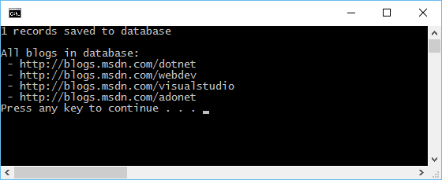

# .NET Framework 下的 EF Core 现有数据库入门指南

在这个演练中，你将使用 Entity Framework 构建一个针对 Microsoft SQL Server 数据库执行基础数据问的控制台应用程序。你将基于一个现有的数据库使用逆向工程来创建 Entity Framework 模型。

> 提示
>
> 你可以[在 GitHub 上查阅当前文章涉及的代码样例](https://github.com/aspnet/EntityFramework.Docs/tree/master/samples/core/GetStarted/FullNet/ConsoleApp.ExistingDb)。

## 先决条件

以下是完成当前演练所需的先决条件：

* [Visual Studio 2017](https://www.visualstudio.com/downloads/)
* [最新版本的 NuGet 程序包管理器](https://dist.nuget.org/index.html)
* [最新版本的 Windows PowerShell](https://www.microsoft.com/en-us/download/details.aspx?id=40855)
* [博客数据库](https://docs.microsoft.com/en-us/ef/core/get-started/full-dotnet/existing-db#blogging-database)

## 博客数据库

当前课程使用你 LocalDB 实例中的一个 **博客** 数据库来作为现有数据库。

> 提示
>
> 如果你在其他课程中已经创建了 **博客** 数据库，可以跳过该步骤

* 启动 Visual Studio
* 工具 > 连接到数据库...
* 选择 **Microsoft SQL Server 并点击 **继续**
* 输入 **(localdb)\mssqllocaldb** 作为服务器名称
* 输入 **master** 作为数据库名称并点击 **确定**
* 现在，master 数据库已经显示在 **服务器资源管理器** 中的 **数据连接** 之下了
* 右键点击 **服务器资源管理器** 中的数据库并选择 **新建查询**
* 将以下列出的脚本复制到新建的查询编辑器中
* 在查询编辑器中点击右键并选择 **执行（Execute）**

```SQL
CREATE DATABASE [Blogging];
GO

USE [Blogging];
GO

CREATE TABLE [Blog] (
    [BlogId] int NOT NULL IDENTITY,
    [Url] nvarchar(max) NOT NULL,
    CONSTRAINT [PK_Blog] PRIMARY KEY ([BlogId])
);
GO

CREATE TABLE [Post] (
    [PostId] int NOT NULL IDENTITY,
    [BlogId] int NOT NULL,
    [Content] nvarchar(max),
    [Title] nvarchar(max),
    CONSTRAINT [PK_Post] PRIMARY KEY ([PostId]),
    CONSTRAINT [FK_Post_Blog_BlogId] FOREIGN KEY ([BlogId]) REFERENCES [Blog] ([BlogId]) ON DELETE CASCADE
);
GO

INSERT INTO [Blog] (Url) VALUES
('http://blogs.msdn.com/dotnet'),
('http://blogs.msdn.com/webdev'),
('http://blogs.msdn.com/visualstudio')
GO
```

## 创建新项目

* 启动 Visual Studio
* 文件 > 新建 > 项目...
* 从左侧菜单开始选择 模板 > Visual C# > Windows 经典桌面
* 选择 **控制台应用（.NET Framework）** 项目模板
* 确保目标框架为 .NET Framework 4.5.1 或更新的版本
* 设置项目名称并点击 **确定**

## 安装 Entity Framework

要使用 EF Core 的话，就要根据你的目标数据库提供程序安装相应的程序包。当前演练使用的是 SQL Server。查看 [数据库提供程序](../../7、数据库提供程序/A、数据库提供程序.md) 可获得可用提供程序的列表。

* 工具 > NuGet 包管理器 > 程序包管理控制台
* 运行 `Install-Package Microsoft.EntityFrameworkCore.SqlServer`

这里还需要安装一组工具包来启用基于现有数据库的逆向工程。

* 运行 `Install-Package Microsoft.EntityFrameworkCore.Tools`

## 逆向工程创建模型

现在，是时候基于现有数据库来创建你的 EF 模型了。

* 工具 > NuGet 包管理器 > 程序包管理控制台
* 运行以下命令以从现有数据库创建模型

```console
Scaffold-DbContext "Server=(localdb)\mssqllocaldb;Database=Blogging;Trusted_Connection=True;" Microsoft.EntityFrameworkCore.SqlServer
```

逆向工程进程会基于现有数据库的模式来创建实体类型并派生一个上下文类型。实体类型是代表你将查询和保存的数据的简单 C# 对象。

```C#
using System;
using System.Collections.Generic;

namespace EFGetStarted.ConsoleApp.ExistingDb
{
    public partial class Blog
    {
        public Blog()
        {
            Post = new HashSet<Post>();
        }

        public int BlogId { get; set; }
        public string Url { get; set; }

        public virtual ICollection<Post> Post { get; set; }
    }
}
```

上下文则表示一个数据库会话，该会话允许你查询和保存上述实体类型的实例。

```C#
using Microsoft.EntityFrameworkCore;
using Microsoft.EntityFrameworkCore.Metadata;

namespace EFGetStarted.ConsoleApp.ExistingDb
{
    public partial class BloggingContext : DbContext
    {
        protected override void OnConfiguring(DbContextOptionsBuilder optionsBuilder)
        {
            #warning To protect potentially sensitive information in your connection string, you should move it out of source code. See http://go.microsoft.com/fwlink/?LinkId=723263 for guidance on storing connection strings.
            optionsBuilder.UseSqlServer(@"Server=(localdb)\mssqllocaldb;Database=Blogging;Trusted_Connection=True;");
        }

        protected override void OnModelCreating(ModelBuilder modelBuilder)
        {
            modelBuilder.Entity<Blog>(entity =>
            {
                entity.Property(e => e.Url).IsRequired();
            });

            modelBuilder.Entity<Post>(entity =>
            {
                entity.HasOne(d => d.Blog)
                    .WithMany(p => p.Post)
                    .HasForeignKey(d => d.BlogId);
            });
        }

        public virtual DbSet<Blog> Blog { get; set; }
        public virtual DbSet<Post> Post { get; set; }
    }
}
```

## 使用模型

现在，你可以使用模型进行数据访问了

* 打开 _Program.cs_
* 使用以下代码替换类文件中的内容：

```C#
using System;

namespace EFGetStarted.ConsoleApp.ExistingDb
{
    class Program
    {
        static void Main(string[] args)
        {
            using (var db = new BloggingContext())
            {
                db.Blog.Add(new Blog { Url = "http://blogs.msdn.com/adonet" });
                var count = db.SaveChanges();
                Console.WriteLine("{0} records saved to database", count);

                Console.WriteLine();
                Console.WriteLine("All blogs in database:");
                foreach (var blog in db.Blog)
                {
                    Console.WriteLine(" - {0}", blog.Url);
                }
            }
        }
    }
}
```

* 调试 > 开始执行（不调试）

你会看到一个 blog 被保存到数据库了，然后所有的 blog 详细信息都被打印到了 控制台。

