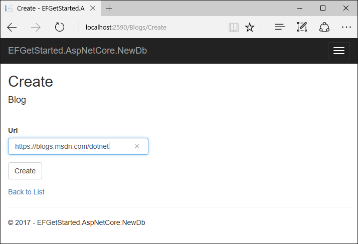
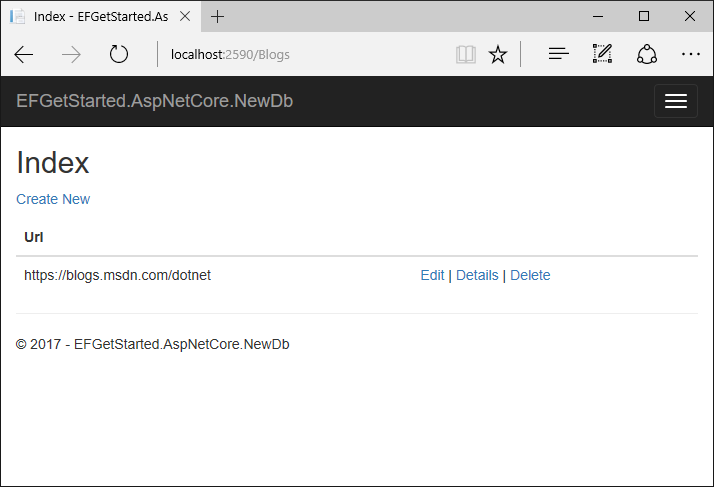

# .NET Framework 下的 EF Core 新数据库入门指南

在这个演练中，你将构建一个使用 Entity Framework Core 进行基础数据访问的 ASP.NET Core MVC 应用程序。你将使用迁移来从模型创建数据库。查看 [其他资源](#其他资源) 以了解更多的 Entity Framework Core 教程。

当前教程需要：

* 具有以下工作负载的 [Visual Studio 2017 15.3](https://www.visualstudio.com/downloads/)：
    * **ASP.NET 和 Web 开发** （在 **Web 或 Cloud** 下）
    * **.NET Core 跨平台开发** （在 **其他工具集** 下 ）
* [.NET Core 2.0 SKD](https://www.microsoft.com/net/download/core)

> 提示
>
> 你可以[在 GitHub 上查阅当前文章涉及的代码样例](https://github.com/aspnet/EntityFramework.Docs/tree/master/samples/core/GetStarted/AspNetCore/EFGetStarted.AspNetCore.NewDb)。

## 创建新项目

* 启动 Visual Studio
* **文件 > 新建 > 项目**
* 从左侧菜单开始选择 **已安装 > 模板 > Visual C# > .NET Core**
* 选择 **ASP.NET Core Web 应用程序** 项目模板
* 输入项目名称 **EFGetStarted.AspNetCore.NewDb** 后点击 **确定**
* 在 **新建 ASP.NET Core Web 应用程序** 对话框中：
    * 确保下拉选择了 **.NET Core** 和 **ASP.NET Core 2.0**
    * 选择 **Web 应用程序（模型视图控制器）** 项目模板
    * 确保已 **更改身份认证** 为 **不进行身份认证**
    * 点击 **确定**

> 警告
>
> 如果你 **更改身份认证** 为 **个人用户账户**，那么模板引擎会将对应的 Entity Framework Core 模型添加到你项目的 `Models\IdentityModel.cs` 中。通过你将在该演练中学到的技术，你可以选择添加一个新的模型，或者将你的实体类添加到生成的模型中。

## 安装 Entity Framework

根据你的目标数据库提供程序安装相应的程序包。当前演练使用的是 SQL Server。查看 [数据库提供程序](../../7、数据库提供程序/A、数据库提供程序.md) 可获得可用提供程序的列表。

* 工具 > NuGet 包管理器 > 程序包管理控制台
* 运行 `Install-Package Microsoft.EntityFrameworkCore.SqlServer`

我们将使用一些 Entity Framework 工具来从你的 EF Core  模型生成数据库。所以我们还要安装工具包：

* 运行 `Install-Package Microsoft.EntityFrameworkCore.Tools`

我们稍后将使用一些 ASP.NET Core 基架工具来创建控制器和视图。所以我们还要安装以下设计工具包：

* 运行 `Install-Package Microsoft.VisualStudio.Web.CodeGeneration.Design`

## 创建模型

定义构成你的模型的上下文和实体类型：

* 右键 **Models** 文件夹并选择 **添加 > 类**.
* 输入名称 _Model.cs_ 然后点击 **确定**
* 使用以下代码替换类文件中的内容：

```C#
using Microsoft.EntityFrameworkCore;
using System.Collections.Generic;

namespace EFGetStarted.AspNetCore.NewDb.Models
{
    public class BloggingContext : DbContext
    {
        public BloggingContext(DbContextOptions<BloggingContext> options)
            : base(options)
        { }

        public DbSet<Blog> Blogs { get; set; }
        public DbSet<Post> Posts { get; set; }
    }

    public class Blog
    {
        public int BlogId { get; set; }
        public string Url { get; set; }

        public List<Post> Posts { get; set; }
    }

    public class Post
    {
        public int PostId { get; set; }
        public string Title { get; set; }
        public string Content { get; set; }

        public int BlogId { get; set; }
        public Blog Blog { get; set; }
    }
}
```

> 提示
>
> 在真实的应用程序里面你会将每个类型放到独立的文件中。为了简单起见，我们将当前课程中的所有代码都放到单一的文件中。

## 将上下文注册到依赖注入

服务（比如 `BloggingContext`）将在应用程序启动时注册到[依赖注入](https://docs.microsoft.com/zh-cn/aspnet/core/fundamentals/dependency-injection)，之后需要使用这些服务的组件（比如 MVC 控制器）就可以通过构造方法参数或属性来获取需要的服务。

为了让我们的 MVC 控制器能够使用 `BloggingContext`，我们要将它注册为服务。

* 打开 **Startup.cs**
* 添加以下 `using` 声明：

```C#
using EFGetStarted.AspNetCore.NewDb.Models;
using Microsoft.EntityFrameworkCore;
```

添加 `AddDbContext` 方法以将 `BloggingContext` 注册为服务：

* 添加以下代码到 ConfigureServices` 方法中：

```C#
public void ConfigureServices(IServiceCollection services)
{
    services.AddMvc();

    var connection = @"Server=(localdb)\mssqllocaldb;Database=EFGetStarted.AspNetCore.NewDb;Trusted_Connection=True;";
    services.AddDbContext<BloggingContext>(options => options.UseSqlServer(connection));
}
```

> 注意
>
> 真实的应用程序通常会将连接字符串放到配置文件中。为了简单起见，我们直接在代码中定义连接字符串。查看[连接字符串](https://docs.microsoft.com/zh-cn/ef/core/miscellaneous/connection-strings)可了解更多信息。

## 创建数据库

你已经有一个模型了，你可以使用[迁移](https://docs.microsoft.com/zh-cn/aspnet/core/data/ef-mvc/migrations#introduction-to-migrations)来创建数据库。

* 工具 > NuGet 包管理器 > 程序包管理控制台（PMC）
* 运行 `Add-Migration InitialCreate` 以搭建一个迁移基架来为你的模型创建初始的表集合。如果输出错误 `无法将“add-migration”项识别为 cmdlet、函数、脚本文件或可运行程序的名称`，请关闭和重新打开 Visual Studio 后再试一次。
* 运行 `Update-Database` 以将新的迁移应用到数据库。该命令会在应用迁移之前创建数据库。

> 提示
>
> 如果你对你的模型做了进一步更改，可以使用 `Add-Migration` 命令搭建新的基架来确保相应的模式能变更到数据库。一旦你签出了基架代码（并根据需要做了任何变更），可以使用 `Update-Database` 命令将变更应用到数据库。
>
> EF 在数据库使用 `__EfMigrationHistory` 表来记录哪些迁移已经被应用到数据库。

## 创建控制器

在项目中搭建基架：

* 在**解决方案资源管理器** 中右键点击 **Controllers** 目录，选择 **添加 > 控制器**。
* 选择 **MVC 依赖项** 后点击 **添加**，然后选择 **最小依赖项** 后点击 **添加**

这样就搭建了 MVC 基架。我们可以为 `Blog` 实体添加一个控制器了。

* 在**解决方案资源管理器** 中右键点击 **Controllers** 目录，选择 **添加 > 控制器**。
* 选择 **视图使用 Entity Framework 的控制器**，然后点击 **添加**。
* 将 **模型类** 设置为 **Blog**，**数据上下文类** 设置为 **BloggingContext**。
* 点击 **添加**

## 运行应用程序

按 F5 运行和测试应用程序。

* 将浏览器导航到 `/Blogs`
* 点击 **Create New** 连接，可以创建一些博客实体，然后就可以测试 **Details** 和 **Delete** 连接了。





## 其他资源

* [EF - SQLite 新数据库](../D、.NETCore/B、新数据库.md)  - 跨平台控制台应用程序 EF 教程。
* [Mac 或 Linux 上的 ASP.NET Core MVC 入门](https://docs.microsoft.com/zh-cn/aspnet/core/tutorials/first-mvc-app-xplat/index)
* [基于 Visual Studio 使用  ASP.NET Core MVC 入门](https://docs.microsoft.com/zh-cn/aspnet/core/tutorials/first-mvc-app/index)
* [基于 Visual Studio 使用 ASP.NET Core 和 Entity Framework Core 入门](https://docs.microsoft.com/zh-cn/aspnet/core/data/ef-mvc/index)