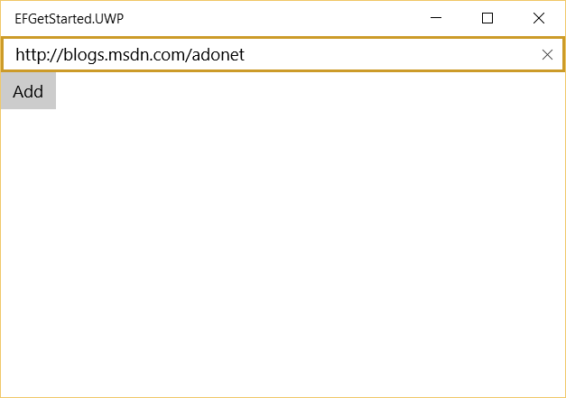
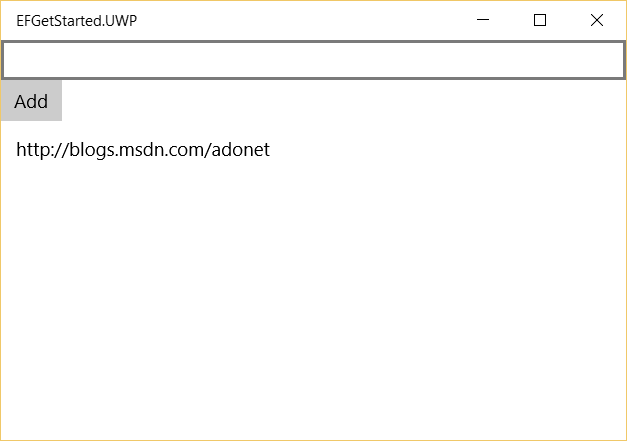

# 通用 Windows 平台（UWP）下的 EF Core 新数据库入门指南

> 注意
>
> 当前教程暂时使用的是 EF Core 1.1。UWP 还没有更新到支持 .NET Standard 2.0 的相应版本，而 .NET Standard 2.0 才是 EF Core 2.0 要求的兼容版本。如果更新了，我们会将教程更新到使用最新版本。

在这个演练中，你将构建一个使用 Entity Famework 针对 SQLite 数据库执行基础数据问的通用 Windows 平台（UWP）应用程序。

> 警告
>
> 在 UWP 中应该避免使用 LINQ 查询的匿名类型。UWP 应用程序需要通过 .NET Native 编译才能发布到应用商店，而具有 匿名类型的查询在 .NET Native 下会表现出很差的性能，甚至导致应用程序崩溃。

> 提示
>
> 你可以[在 GitHub 上查阅当前文章涉及的代码样例](https://github.com/aspnet/EntityFramework.Docs/tree/master/samples/core/GetStarted/UWP/UWP.SQLite)。

## 先决条件

以下是完成当前演练所需的先决条件：

* Windows 10
* [Visual Studio 2017](https://www.visualstudio.com/downloads/)
* 最新版本的 [Windows 10 开发者工具](https://dev.windows.com/en-us/downloads)

## 创建新项目

* 启动 Visual Studio
* **文件 > 新建 > 项目...**
* 从左侧菜单开始选择 **模板 > Visual C# > Windows 通用**
* 选择 **空白应用（通用 Windows）** 项目模板
* 输入一个项目名称，然后点击 **确定**

## 更新 Microsoft.NETCore.UniversalWindowsPlatform

基于你的 Visual Studio 版本，项目模板可能会使用旧版本的 .NET Core 来为 UWP 生成项目。EF Core 需要 `Microsoft.NETCore.UniversalWindowsPlatform` **5.2.2** 或以上版本的支持。

* 工具 > NuGet 包管理器 > 程序包管理控制台
* 运行 `Update-Package Microsoft.NETCore.UniversalWindowsPlatform -Versio 5.2.2`

> 提示
>
> 如果你正在使用的是 Visual Studio 2017，你可以直接将 `Microsoft.NETCore.UniversalWindowsPlatform` 更新到最新版本，无需显式指定为 `5.2.2`。

## 安装 Entity Framework Core

要使用 EF Core 的话，就要根据你的目标数据库提供程序安装相应的程序包。当前演练使用的是 SQLite。查看 [数据库提供程序](../../7、数据库提供程序/A、数据库提供程序.md) 可获得可用提供程序的列表。

* 工具 > NuGet 包管理器 > 程序包管理控制台
* 运行 `Install-Package Microsoft.EntityFrameworkCore.Sqlite`

我们将使用一些 Entity Framework 工具来维护数据库。所以我们还要安装工具包：

* 运行 `Install-Package Microsoft.EntityFrameworkCore.Tools`

## 创建模型

现在，是时候定义构成你的模型的上下文和实体类型了。

* 右键点击项目 > 添加 > 类
* 输入名称 _Model.cs_ 然后点击 **确定**
* 使用以下代码替换类文件中的内容

```C#
sing Microsoft.EntityFrameworkCore;
using System.Collections.Generic;

namespace EFGetStarted.UWP
{
    public class BloggingContext : DbContext
    {
        public DbSet<Blog> Blogs { get; set; }
        public DbSet<Post> Posts { get; set; }

        protected override void OnConfiguring(DbContextOptionsBuilder optionsBuilder)
        {
            optionsBuilder.UseSqlite("Data Source=blogging.db");
        }
    }

    public class Blog
    {
        public int BlogId { get; set; }
        public string Url { get; set; }

        public List<Post> Posts { get; set; }
    }

    public class Post
    {
        public int PostId { get; set; }
        public string Title { get; set; }
        public string Content { get; set; }

        public int BlogId { get; set; }
        public Blog Blog { get; set; }
    }
}
```

## 创建数据库

你已经有一个模型了，你可以使用[迁移](https://docs.microsoft.com/aspnet/core/data/ef-mvc/migrations#introduction-to-migrations)来创建数据库。

* 工具 > NuGet 包管理器 > 程序包管理控制台
* 运行 `Add-Migrations MyFirstMigration` 以搭建一个迁移基架来为你的模型创建初始的表集合。

因为我们要在应用程序运行所在的设备上创建数据库，所以我们将添加一些代码以在应用程序启动时将追加的迁移应用到本地数据库中。应用程序首次运行时，该步骤还将负责为我们创建本地数据库。

* 在 **解决方案资源管理器** 中右键点击 **App.xaml**，然后选择 **查看代码**
* 添加以下 using 代码

```C#
using Microsoft.EntityFrameworkCore;
```

* 添加相关代码以应用追加的迁移

```C#
public App()
{
    this.InitializeComponent();
    this.Suspending += OnSuspending;

    using (var db = new BloggingContext())
    {
        db.Database.Migrate();
    }
}
```

> 提示
>
> 如果你对你的模型做了进一步更改，可以使用 `Add-Migration` 命令搭建新的基架来确保相应的模式能变更到数据库。当应用程序启动时，任何追加的迁移都将被应用到所在设备的本地数据库中。
>
> EF 在数据库使用 `__EfMigrationHistory` 表来记录哪些迁移已经被应用到数据库。

## 使用模型

现在，你可以使用模型进行数据访问了

* 打开 MainPage.xaml_
* 添加相关的页面加载处理程序和 UI 内容

```xml
<Page
    x:Class="EFGetStarted.UWP.MainPage"
    xmlns="http://schemas.microsoft.com/winfx/2006/xaml/presentation"
    xmlns:x="http://schemas.microsoft.com/winfx/2006/xaml"
    xmlns:local="using:EFGetStarted.UWP"
    xmlns:d="http://schemas.microsoft.com/expression/blend/2008"
    xmlns:mc="http://schemas.openxmlformats.org/markup-compatibility/2006"
    mc:Ignorable="d"
    Loaded="Page_Loaded">

    <Grid Background="{ThemeResource ApplicationPageBackgroundThemeBrush}">
        <StackPanel>
            <TextBox Name="NewBlogUrl"></TextBox>
            <Button Click="Add_Click">Add</Button>
            <ListView Name="Blogs">
                <ListView.ItemTemplate>
                    <DataTemplate>
                        <TextBlock Text="{Binding Url}" />
                    </DataTemplate>
                </ListView.ItemTemplate>
            </ListView>
        </StackPanel>
    </Grid>
</Page>
```

现在，我们将添加一些代码来关联 UI 和数据库

* 在 **解决方案资源管理器** 中右键点击 **MainPage.xaml**，然后选择 **查看代码**
* 添加相应代码

```C#
public sealed partial class MainPage : Page
{
    public MainPage()
    {
        this.InitializeComponent();
    }

    private void Page_Loaded(object sender, RoutedEventArgs e)
    {
        using (var db = new BloggingContext())
        {
            Blogs.ItemsSource = db.Blogs.ToList();
        }
    }

    private void Add_Click(object sender, RoutedEventArgs e)
    {
        using (var db = new BloggingContext())
        {
            var blog = new Blog { Url = NewBlogUrl.Text };
            db.Blogs.Add(blog);
            db.SaveChanges();

            Blogs.ItemsSource = db.Blogs.ToList();
        }
    }
}
```

你现在可以运行应用程序以查看它的行为了。

* 调试 > 开始执行（不调试）
* 等待应用程序编译和启动
* 输入一个 URL 并点击 **Add** 按钮





## 后续步骤

很好！现在你已经运行了一个基于 Entity Framework 的简单 UWP 应用程序了。

查看该帮助文档的其他教程，你可以了解更多 Entity Framework 的功能。